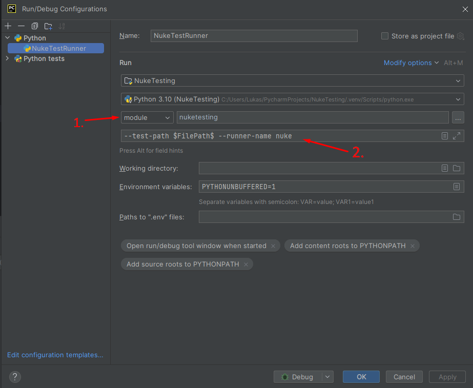
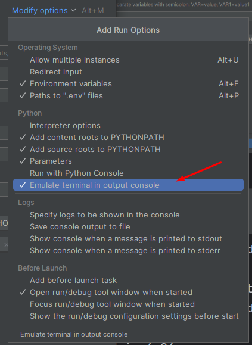

# Debugging unittests in Nuke
The testrunner will automatically detect if you run it with an active debugger and will try to establish a 
connection from within the Nuke context.
This will make it easy to debug your tests.

```{warning}
This feature is currently only available for IDEs which use the `pydevd` package (PyCharm, LiClipse).
```

## Configuration for PyCharm
Create a new run configuration and select `module` as run option.
In the textfield, use `nuketesting` for running the testrunner with PyCharm.
Afterward, add the commandline arguments for the testrunner.
Now you can start and debug from within PyCharm!



If you like the colors of `pytest`, you can select the `Emulate terminal in output console` run option to enable them in PyCharm:

